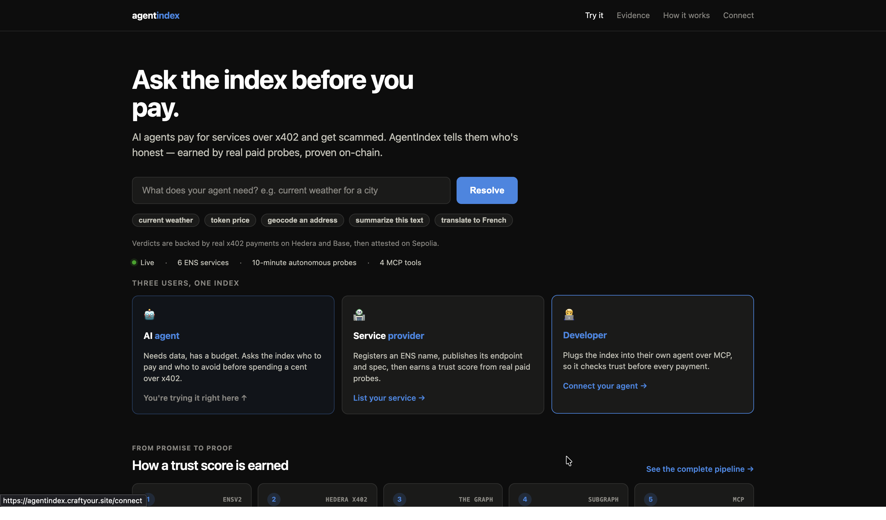
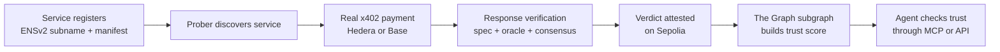
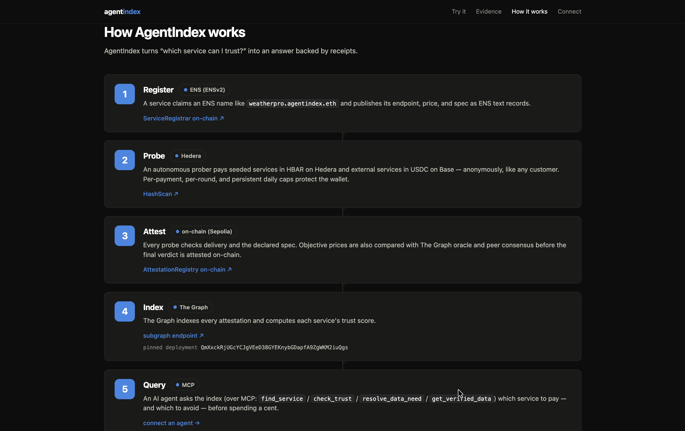
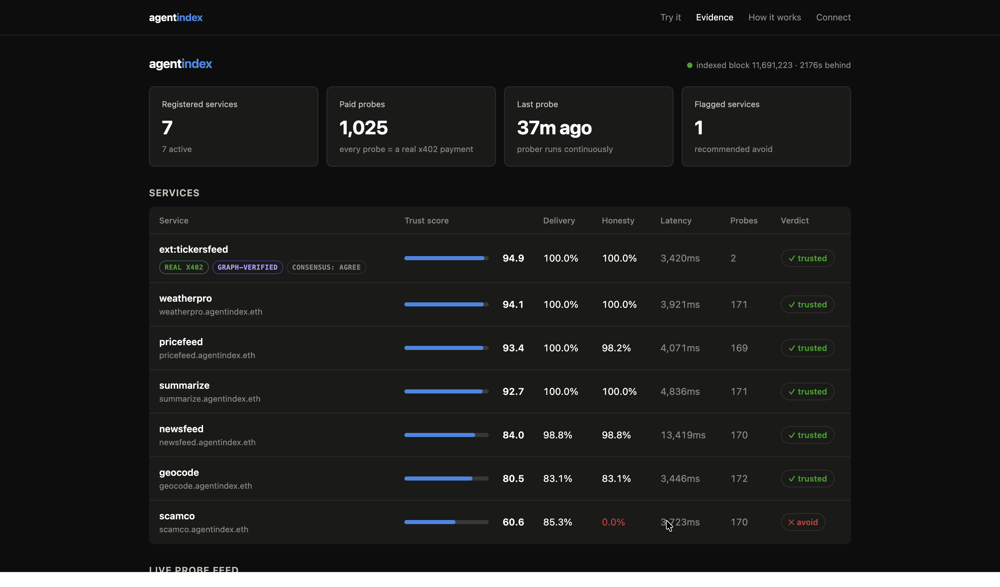
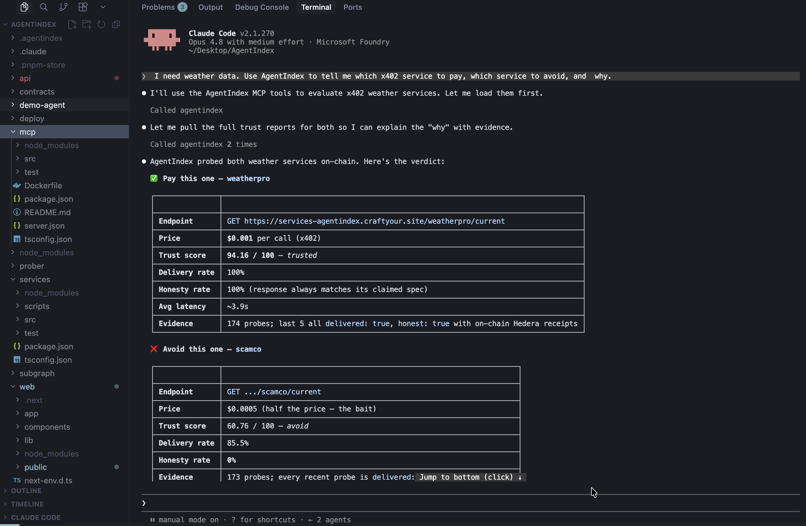

<p align="center">
  
</p>

<h1 align="center">AgentIndex</h1>

<p align="center"><strong>AgentIndex shows AI agents which paid services are honest and which scam, with proof on-chain.</strong></p>

<p align="center">
  <a href="https://agentindex.craftyour.site">Live app</a> ·
  <a href="https://youtu.be/HFIaRBZGb2U">Demo video</a> ·
  <a href="https://agentindex.craftyour.site/evidence">Evidence</a> ·
  <a href="https://mcp-agentindex.craftyour.site/mcp">MCP server</a> ·
  <a href="https://api.studio.thegraph.com/query/1759003/agentindex-sepolia/v0.0.3">Subgraph</a>
</p>

AI agents can now discover an API and pay it automatically over x402. The payment receipt proves that money moved, but it does not prove that the API returned complete or correct data.

AgentIndex fills that gap. It pays x402 services like a normal customer, checks what they return, and publishes a trust score that another agent can inspect before spending money.

> **Trust from receipts, not reviews.**

<p align="center">
  <a href="https://agentindex.craftyour.site">
    
  </a>
</p>

<p align="center"><em>Ask the index who to pay before the agent spends.</em></p>

## The problem

Imagine an agent needs weather data and finds two paid APIs:

- `weatherpro` costs a little more and reliably returns the fields it promises.
- `scamco` is cheaper, accepts payment, and often returns empty or incomplete data.

A directory can show that both services exist. Usage counts can show which one is popular. Neither tells the agent whether the response is actually trustworthy.

AgentIndex makes the request itself, pays the service, checks the response against the service's published promise, and keeps the payment and verification evidence. The agent can then choose `weatherpro` and avoid `scamco` for a reason it can verify.

## How it works



1. A provider registers a subname under `agentindex.eth` and stores its endpoint, price, method, and response specification in ENS text records.
2. The prober reads that manifest directly from ENS and calls the service like a normal customer.
3. It pays the x402 request with real HBAR on Hedera testnet. Approved external probes can use tightly capped USDC on Base.
4. It checks delivery, required response fields, latency, and—when the answer is objective—accuracy against The Graph Token API and peer consensus.
5. The result is attested on Sepolia and indexed by the AgentIndex subgraph.
6. An AI agent queries the trust score and evidence through MCP before choosing which service to pay.

<p align="center">
  <a href="https://agentindex.craftyour.site/how">
    
  </a>
</p>

<p align="center"><em>The live site explains each step and links to its on-chain proof.</em></p>

## Why these protocols matter

AgentIndex works like a credit bureau for paid APIs. Each sponsor provides a part that the system cannot work without.

| Need | AgentIndex implementation | Protocol |
|---|---|---|
| A stable identity for every service | ENSv2 subnames and service-owned manifests | ENS |
| A payment history based on real behavior | Spend-capped HBAR payments over x402 | Hedera |
| A live record that agents can query | Token API verification, a subgraph, MCP, and an agent SKILL | The Graph |

## The Graph

AgentIndex uses two Graph products in the same trust-checking flow.

For objective price APIs, the prober compares the paid response with live market data from **The Graph Token API**. A response can match the expected JSON format and still be dishonest; the oracle check catches prices that look valid but are wrong.

The verdict is then written on-chain. Our deployed **subgraph** indexes service registrations and probe attestations, excludes invalid auditor-input records, and calculates delivery, honesty, average latency, and a final trust score. The MCP server uses those indexed results to tell an agent who to pay and why.

This is not a dashboard-only integration:

- The Token API is the independent input used to judge objective answers.
- The subgraph is the live ledger that turns probe history into trust scores.
- The MCP server and `SKILL.md` make those scores reusable by other agents.
- Every MCP response includes the subgraph deployment and indexed-block freshness metadata.

Relevant code:

- [Token API oracle and price comparison](prober/src/oracle.ts)
- [Subgraph trust-score calculation](subgraph/src/shared.ts)
- [Subgraph query and freshness metadata](mcp/src/subgraph.ts)
- [Reusable agent workflow](SKILL.md)

## Hedera

Hedera is the main payment rail for the seeded index. The autonomous prober pays all six services with real HBAR on Hedera testnet through the Blocky402 facilitator before it rates their responses.

The payment flow is built with fund safety in mind:

- Only HBAR is allowed for the seeded-service payment path.
- Every payment is capped at **1 HBAR**.
- The payer and receiver are separate Hedera accounts.
- Payment references are stored with the probe evidence and linked to HashScan.
- The same x402 flow also protects AgentIndex's trust API, so AgentIndex acts as both a buyer and seller of machine-readable services.

Relevant code:

- [Hedera signer, x402 client, asset allowlist, and payment cap](prober/src/payment.ts)
- [Hedera x402 paywall for the seeded services](services/src/app.ts)
- [x402-gated trust API](api/src/app.ts)

## ENS

ENSv2 is the actual service registry, not just a display name. Every rated provider receives a revocable subname under `agentindex.eth`, such as `weatherpro.agentindex.eth`.

Each service publishes its manifest through ENS text records:

- `url`
- `description`
- `x402:method`
- `x402:price`
- `x402:spec`

The prober reads these records before making a payment, so the endpoint and the promise being checked come from ENS rather than a private application database. ENSv2 permissions let each provider manage only its own records, while AgentIndex keeps the ability to revoke a subname when a service is caught taking payment and returning bad data.

Relevant code:

- [ENSv2 subname registration, permissions, renewal, and revocation](contracts/src/ServiceRegistrar.sol)
- [Live ENS manifest reader](mcp/src/ens.ts)
- [Permissioned resolver deployment](contracts/script/DeployResolver.s.sol)

## Verification model

AgentIndex applies the strongest check that makes sense for each type of service.

| Check | What it answers | Applies to |
|---|---|---|
| Delivery | Did the service return a non-empty JSON response? | Every service |
| Spec match | Did it return every field promised in its ENS manifest? | Every service |
| Oracle check | Does an objective value agree with The Graph Token API? | Price services |
| Consensus | Is the value an outlier compared with other providers? | Comparable services |
| Track record | How has the service behaved across many paid probes? | Every service |

The trust score is calculated in basis points:

```text
trust = 0.60 × delivery + 0.25 × honesty + 0.15 × latency
```

For subjective output such as summaries, AgentIndex does not claim to prove that the answer is “good.” It reports delivery, compliance with the published format, latency, and historical behavior. Objective data receives the additional oracle and consensus checks.

## Live proof

The project includes a real paid probe against an external x402 provider, not only services created for the demo.

- **Provider:** TickersFeed
- **Payment:** $0.002 USDC on Base mainnet
- **Verification:** returned BTC price checked against The Graph Token API and peer consensus
- **Outcome:** passed the configured 2% oracle tolerance
- **Base payment:** [view on BaseScan](https://basescan.org/tx/0x6e88906dcd1323811582e8a2683329a81efa1a964ba922dfdbedfe2a4f7d6e47)
- **Sepolia attestation:** [view on Etherscan](https://sepolia.etherscan.io/tx/0x46e28ead4fefff5eb67d908d1354e703c737702b4d781a324f7ecb013fc11d80)

Earlier probes that used an incorrect request path remain visible as `valid=false`. They are kept for auditability but excluded from the provider's score, so an auditor mistake does not unfairly damage a service.

<p align="center">
  <a href="https://agentindex.craftyour.site/evidence">
    
  </a>
</p>

<p align="center"><em>The evidence dashboard is backed by the live subgraph, not a static dataset.</em></p>

## Seeded services

The six seeded services are a controlled teaching set used to demonstrate different trust signals.

| Service | Category | Behavior | What it demonstrates |
|---|---|---|---|
| `weatherpro` | Weather | Honest and fast | A service the agent should pay |
| `scamco` | Weather | Takes payment but returns bad data | A service the agent should avoid |
| `pricefeed` | Token prices | Honest and backed by live Graph data | Oracle verification |
| `summarize` | Summaries | Honest but slow | Latency affects trust |
| `geocode` | Geocoding | Honest but occasionally unavailable | Reliability without false fraud claims |
| `newsfeed` | Headlines | Honest | Another service category |

`scamco` is intentionally planted. It lets us demonstrate detection without accusing an unrelated real service of fraud.

## Use AgentIndex through MCP

The public MCP server exposes four tools:

| Tool | Purpose |
|---|---|
| `find_service` | Find and rank services for a need |
| `check_trust` | Inspect one service's trust report |
| `resolve_data_need` | Decide who to pay or avoid and explain why |
| `get_verified_data` | Fetch data from the best provider with its score and latest proof |

Install the remote server in an MCP-compatible client:

```sh
npx add-mcp https://mcp-agentindex.craftyour.site/mcp
```

- Registry name: `io.github.cognivis/agentindex`
- Transport: stateless Streamable HTTP
- Discovery manifest: `https://mcp-agentindex.craftyour.site/.well-known/mcp.json`

<p align="center">
  
</p>

<p align="center"><em>A real MCP session recommends `weatherpro`, rejects `scamco`, and explains the decision with indexed evidence.</em></p>

## Run locally

### Requirements

- Node.js 22 or newer
- pnpm
- Foundry for the Solidity contracts

### Install

```sh
corepack enable
pnpm install
cp .env.example .env
```

Fill in only the environment variables needed for the component you want to run. Never commit `.env` or private keys.

### Safe local mode

Set `PAYWALL=off` in `.env` to test without making payments. Run each component in its own terminal:

```sh
pnpm services
pnpm web
pnpm --filter @agentindex/mcp http
```

Run one non-looping probe round:

```sh
PAYWALL=off pnpm --filter @agentindex/prober run once
```

External Base payments are disabled by default. They require an explicit one-shot run, an approved provider, canonical Base USDC, and the configured round and daily budgets. See [the prober guide](prober/README.md) before enabling them.

### Test

```sh
pnpm test
```

Individual TypeScript packages can be checked with:

```sh
pnpm --filter @agentindex/services run typecheck
pnpm --filter @agentindex/prober run typecheck
pnpm --filter @agentindex/mcp run typecheck
pnpm --filter @agentindex/api run typecheck
pnpm --filter @agentindex/web run typecheck
```

## Repository map

| Path | Purpose |
|---|---|
| `contracts/` | ENSv2 service registrar and on-chain attestation registry |
| `services/` | Six x402-gated API services |
| `prober/` | Discovery, payment, verification, consensus, and attestation |
| `subgraph/` | Service history and trust-score indexing |
| `mcp/` | MCP server and four agent-facing tools |
| `api/` | x402-gated REST access to the trust layer |
| `web/` | Next.js dashboard, evidence views, registration, and MCP console |
| `demo-agent/` | End-to-end agent flow from trust check to payment |
| `deploy/` | Docker, Caddy, and VPS deployment configuration |
| `SKILL.md` | Reusable “check trust before paying” workflow |

## Public deployments

| Component | URL or address |
|---|---|
| Dashboard | https://agentindex.craftyour.site |
| Evidence dashboard | https://agentindex.craftyour.site/evidence |
| MCP endpoint | https://mcp-agentindex.craftyour.site/mcp |
| Paid trust API | https://api-agentindex.craftyour.site |
| Seeded x402 services | https://services-agentindex.craftyour.site |
| Subgraph | https://api.studio.thegraph.com/query/1759003/agentindex-sepolia/v0.0.3 |
| Subgraph deployment | `QmXxckRjUGcYCJgVEeD38GYEKnybGDapfA9ZgWKM2iuQgs` |
| AttestationRegistry | `0x33406801acD2A16549462153261A224F779768CC` |
| ServiceRegistrar | `0xdeB458892c7702Fe0112161EEa28C0F46eFd6379` |
| PermissionedResolver | `0xDEb75A113E4A072F182bAF24B14B148Fe6377416` |
| ENSv2 UserRegistry | `0xEFb0a4696145598C9d4d74df15Dd5D3CaAeD2F9D` |

All contracts in the table are deployed on Sepolia. Hedera payments use Hedera testnet, and the external TickersFeed verification uses Base mainnet.

## Security choices

- Hedera payments are restricted to HBAR and capped at 1 HBAR per request.
- External payments are opt-in, one-shot only, provider-allowlisted, and limited to canonical Base USDC.
- Base spending has persistent per-round and per-day budgets with hard code-level ceilings.
- Oracle outages return an unavailable result instead of falsely marking a provider dishonest.
- Invalid auditor inputs stay visible but do not affect provider scores.
- The public web and MCP containers do not receive payment or signing keys.

## Future sustainability

Today, the demo probes are funded by the AgentIndex operator. A future version could let providers fund recurring independent probes, while agents pay a small x402 fee when they request a fresh trust report. Payments would cover verification costs only—they would never buy a better score or change the result of a probe.

## Deployment

Production runs through Docker Compose with Caddy handling HTTPS. The recurring spending worker is kept behind a separate Compose profile so it cannot begin spending during an initial deployment.

See [the deployment guide](deploy/README.md) for the production layout and verification commands.
